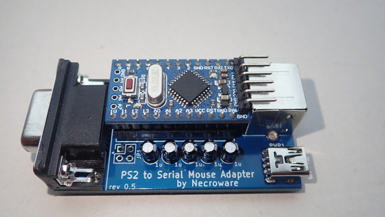

# PS/2 to Serial Mouse Adapter

Many retro PCs were used with serial port mouse and don't have any PS/2 ports.
Unfortunately most of the serial mice are broken or expensive today. Furthermore
they were mechanical devices with a heavy steel ball to track the movement. This
mechanics got dirty quite fast and was not the best user experience anyway. A
better solution are optical PS/2 mice, most of which unfortunately would not 
work on a serial port. This adapter can be used to connect such a PS/2 mouse to
a serial port of a retro PC.

## How does it work?

The serial port on the computer communicates with the mouse using basically two
pins - RTS and RX. RTS is used for notification and RX for the actual data
transfer, which contains mouse position, buttons state etcetera. A standard PS/2
mouse on the other hand uses completely incompatible protocol and transfers the
data between the mouse and the computer using the Data and Clock pins. If we
want to connect a PS/2 mouse, to a serial port, we need some instance in
between, to translate between the two different protocols. In this adapter the
translation is done using an Arduino Mini. However, there is another problem.
PS/2 mouse  protocol uses so called TTL logic, which simply means, that the
voltage of 0V means a logical zero and 5V means a logical one. TTL logic is what
Arduino uses as well, but a serial port, or also called RS232, uses another
voltage levels. Any voltage below -3V is a logical one and a voltage above +3V
is a logical zero. So, it is not possible to connect Arduino output directly to
the serial port. It simply will not work and needs another translator, which
converts TTL voltage level to RS232 levels. In this adapter such conversion is
made by a well known MAX232 IC. The software is written in C, it is a simple
Arduino project, which can be used in Arduino Studio as usual.

## How to use?

This project contains everything you need to build your own adapter. You can use
the gerber files to order a PCB. The list of materials is below. After soldering
the adapter, connect the Arduino Mini using FTDI to your PC and flash the 
firmware using Arduino Studio. If you don't know how to do that, please refer to
the documentation of Arduino. 

**ATTENTION!** *The USB port (PWR1) on the adapter is only for powering the
circuits, it is not a data port!*

Connecting the adapter to the PC is very simple. Plug your PS/2 Mouse into the
adapter, connect a mini USB cable to power the adapter. Plug the adapter into a
serial port of your PC. Turn on the PC and use a serial mouse driver of your
choice. The adapter was tested with Microsoft, Logitech and Cute mouse drivers.
Cute Mouse Driver is part of FreeDos project and is free and open source.

**REMARK:** *Jumper JP1 is currently not in use.*

## Bill of materials

Reference  |#  |LCSC   |Description
-----------|---|-------|------------------------------------------
U1         |1  |       | Arduino Pro Mini 5V (ATMega168 or better)
U2         |1  |C911187| MAX232 or compatible DIP16 package
RS232      |1  |C141882| DB9 female RS232 port
MOUSE1     |1  |C77848 | PS/2 female port
PWR1       |1  |C46398 | Mini-USB port for power supply
C1-5       |5  |C106448| 1µF electrolytic capacitor
JP1        |1  |       | 2x2 jumper header (optional)

## Links

* [PS/2 Mouse Protocol](http://www-ug.eecg.utoronto.ca/desl/nios_devices_SoC/datasheets/PS2%20Protocol.htm)
* [Serial Mouse Protocol](https://linux.die.net/man/4/mouse)
* [Cute Mouse Driver](http://cutemouse.sourceforge.net)
